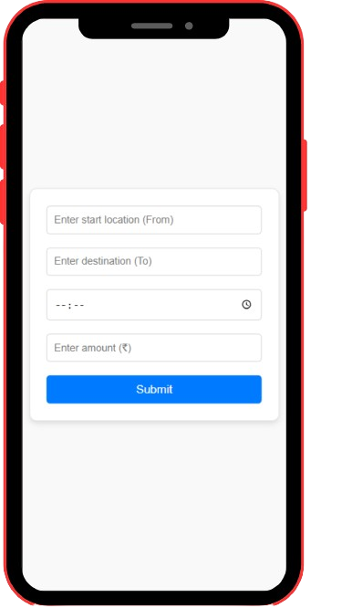
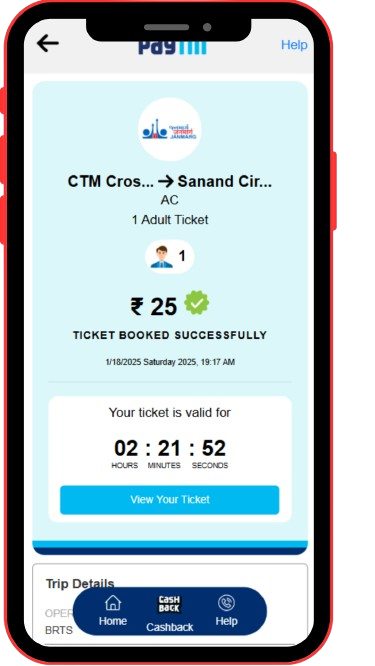
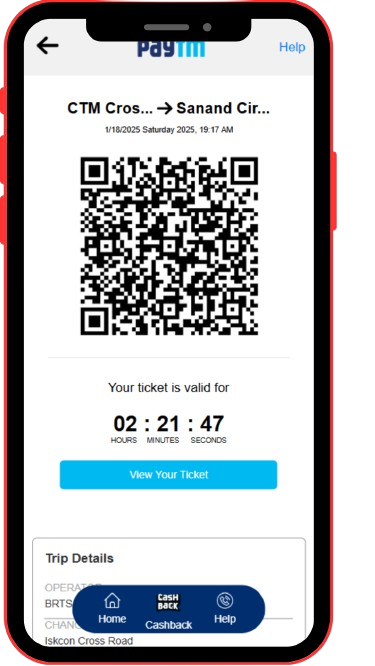

# BRTS-Paytm

This project is a clone of the Paytm BRTS (Bus Rapid Transit System) Booking service, created using HTML, CSS, and JavaScript. The website is designed to be mobile-first, providing an optimized user experience for mobile devices.

## Preview

You can preview the live project at:  
[Live Demo](https://joshivedant7.github.io/brts-paytm/index.html)

## Technologies Used
- **HTML** 
- **CSS** 
- **JavaScript** 
## Screenshots
Here are three preview images of the mobile-first interface displayed side by side:

<div style="display: flex; justify-content: space-between;">
    
    
    
</div>

## Installation
To view or run the project locally:
1. Clone this repository:
   ```bash
   git clone https://github.com/joshivedant7/brts-paytm

  <div style="color: #000000"> 
        <h4>
            Do not misuse this project.
        </h4>
        </div>
